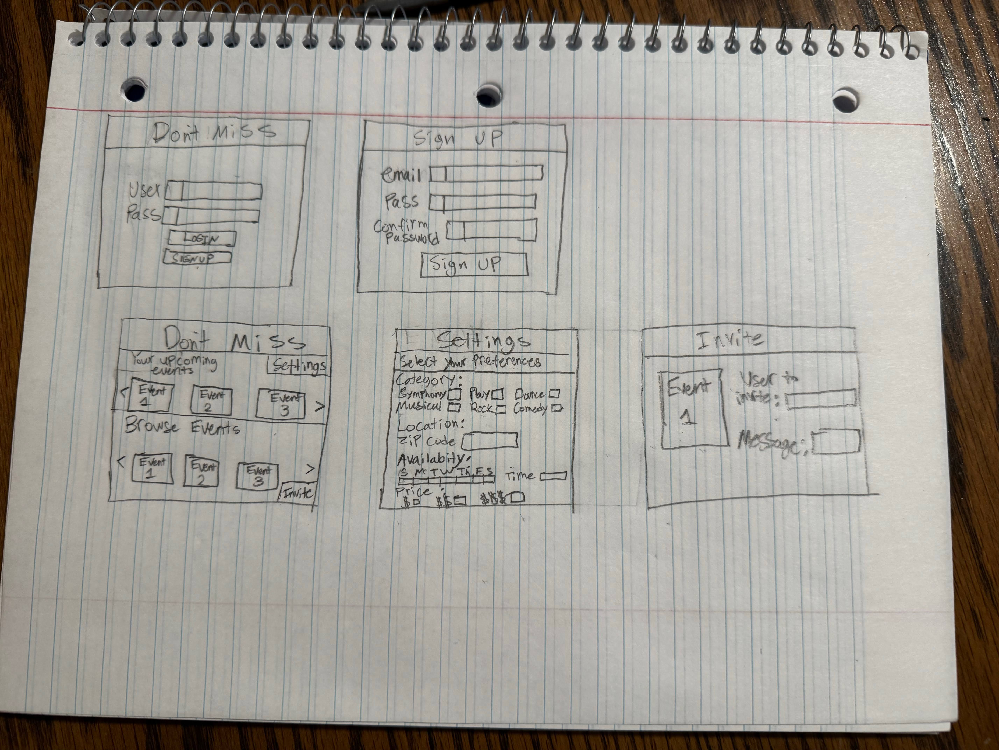

Don't Miss

[My Notes](notes.md)

## 🚀 Specification Deliverable
For this deliverable I did the following. I checked the box `[x]` and added a description for things I completed.

- [x] Proper use of Markdown
- [x] A concise and compelling elevator pitch
- [x] Description of key features
- [x] Description of how you will use each technology
- [x] One or more rough sketches of your application. Images must be embedded in this file using Markdown image references.

### Elevator pitch

Have you ever realized just moments too late that you missed out on attending one of your favorite events? Maybe you are just too last minute and the tickets were are all sold out, or maybe you just didn't even know it existed. Whatever the case, it can be big let down to miss out on a night like that. With this app, you never have to worry about that again! Simply input what kinds of events you are interested in, what days and times you are available, your location and price range, and you will be alerted whenever an event matches your preferences! Level up you weekends with this app!

### Design

### Key features

- Secure login over https
- Ability to sign up for account
- Ability to select and change user preferences
- Ability to use arrows to browse upcoming events
- Ability to invite other users with a custom message

### Technologies

I am going to use the required technologies in the following ways.

- **HTML** - Uses correct HTML structure. 5 HTML pages, 1 for login, 1 for sign up, 1 for event listings, 1 for settings, and 1 for sending invites
- **CSS** - Application styling that looks good on different screen sizes. Spacing, and colors look good. Gives it a movie theatre kind of feel.
- **React** - Provides login, sign up, event browsing capability, preference selection, and invite capability
- **Service** - Backend service with endpoints for:
  -login
  -retrieving user preferences
  -setting user preferences
- **DB/Login** - Store user preferences and messages. Login and register users. Credentials securely stored in database. 
- **WebSocket** - A message can be recieved/sent in real time from one user to another.

## 🚀 AWS deliverable

For this deliverable I did the following. I checked the box `[x]` and added a description for things I completed.

- [ ] **Server deployed and accessible with custom domain name** - [My server link](https://yourdomainnamehere.click).

## 🚀 HTML deliverable

For this deliverable I did the following. I checked the box `[x]` and added a description for things I completed.
- [x]  I completed the prerequisites for this deliverable (Simon deployed, GitHub link, Git commits)
- [x] **HTML pages** - Three HTML pages representing ability to login, browse events, and save preferences.
- [x] **Proper HTML element usage** - I correctly used head, body, header, nav, main, footer, and many other elements
- [x] **Links** - Login page links to discover page, settings also links to discover page, but each page has links to all three.
- [x] **Text** - I added captures to each of my event placeholders.
- [x] **3rd party API placeholder** - Placeholders for where I will display the event information from the APIs
- [x] **Images** - I used card images for my events. 
- [x] **Login placeholder** - Input box for login
- [x] **DB data placeholder** - The preferences will be set to the saved responses from the database
- [x] **WebSocket placeholder** - The Invite text field will be a real time websocket feature that lets you get and recieve invites.

## 🚀 CSS deliverable

For this deliverable I did the following. I checked the box `[x]` and added a description for things I completed.

- [x] **Visually appealing colors and layout. No overflowing elements.** - I used flexbox to make it appealing and avoid overflow, and bootstrap to ensure that the colors look nice.
- [x] **Use of a CSS framework** - I used boostrap
- [x] **All visual elements styled using CSS** - I used only bootstrap in the html, and custom css styling
- [x] **Responsive to window resizing using flexbox and/or grid display** - I used a flexbox
- [x] **Use of a imported font** - I used the Orbitron font from google fonts
- [x] **Use of different types of selectors including element, class, ID, and pseudo selectors** - I used elements, classes, ids, and the hover pseudo selector.

## 🚀 React part 1: Routing deliverable

For this deliverable I did the following. I checked the box `[x]` and added a description for things I completed.

- [x] **Bundled using Vite** - I bundled with vite.
- [x] **Components** - I put my login, discover, and preferences into components
- [x] **Router** - I used the router to display the components.

## 🚀 React part 2: Reactivity deliverable

For this deliverable I did the following. I checked the box `[x]` and added a description for things I completed.

- [ ] **All functionality implemented or mocked out** - I did not complete this part of the deliverable.
- [ ] **Hooks** - I did not complete this part of the deliverable.

## 🚀 Service deliverable

For this deliverable I did the following. I checked the box `[x]` and added a description for things I completed.

- [ ] **Node.js/Express HTTP service** - I did not complete this part of the deliverable.
- [ ] **Static middleware for frontend** - I did not complete this part of the deliverable.
- [ ] **Calls to third party endpoints** - I did not complete this part of the deliverable.
- [ ] **Backend service endpoints** - I did not complete this part of the deliverable.
- [ ] **Frontend calls service endpoints** - I did not complete this part of the deliverable.
- [ ] **Supports registration, login, logout, and restricted endpoint** - I did not complete this part of the deliverable.

## 🚀 DB deliverable

For this deliverable I did the following. I checked the box `[x]` and added a description for things I completed.

- [ ] **Stores data in MongoDB** - I did not complete this part of the deliverable.
- [ ] **Stores credentials in MongoDB** - I did not complete this part of the deliverable.

## 🚀 WebSocket deliverable

For this deliverable I did the following. I checked the box `[x]` and added a description for things I completed.

- [ ] **Backend listens for WebSocket connection** - I did not complete this part of the deliverable.
- [ ] **Frontend makes WebSocket connection** - I did not complete this part of the deliverable.
- [ ] **Data sent over WebSocket connection** - I did not complete this part of the deliverable.
- [ ] **WebSocket data displayed** - I did not complete this part of the deliverable.
- [ ] **Application is fully functional** - I did not complete this part of the deliverable.
